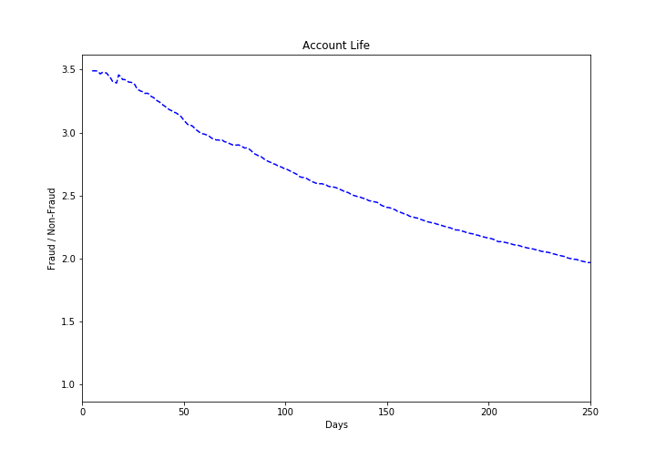

# fraud_detection_events
Fraud Detection Model for &lt;event-company>. Data is not included due to confidentiality.

---

# Pre-processing

---

Identify Fraudulent Response variable

```python
df['fraud'] = df['acct_type'].str.contains("fraud")
```

---

### Feature Selection

---

To train the model, 250MB of JSON data was provided by the company.  The dataset is structured with users labeled in several classes, but importantly, the known fraud events are labeled.   The event training data has 43 features, many of which are not useful for predicting fraud.   

To determine the principle features to include in our model training set, we determined individual feature separation distance between fraudn and non-fraud events.  For example, if Feature 1 has a mean value of 2 for fraud events and a mean value of 20 for non-fraud events, we consider this separation 10X and is a good feature to use for model fitting.


__Relative ratios of features for fraud and not-fraud (examples)__

| Feature | Fraud | Not Fraud | Feature Separation | Description |
| --------| ----- | --------- | ----------- | --------- | 
| Account life| 0.18 | 0.82| 4.63 |Number of days from user creation to event date |
| fb_published| 0.13| 0.86| 6.15 | Was event published on FaceBook ? |
|org_facebook |0.1|0.99| 9.09 | Number of users in Facebook Group |
|org_twitter|0.04|0.95| 19.61 | Number of Twitter followers of event |
|has_analytics|0.03|0.96| 25.85 | Was analytics used in the event planning web page ? |
|payout_type (exists)|0.4|0.6| 1.53 | Method of payment after the event |
|event_life|0.39|0.6| 8.55 | Number of days between event creation and event end |
| wc_description |  |  | 2.01 | Number of words in event description |
| total_payout |  |  |  76.5 | Total amount payed out after event |


|*Unused* (examples)| Fraud | Not Fraud | Feature Separation |
| --------| ----- | --------- | ----------- |
|listed |0.49|0.51| 1.04 |
|show_map |0.46 | 0.54| 1.17 |
|has_logo | 0.43| 0.57 | 1.32 |


Short Descriptions ('body_length')

Fraudulent descriptions are most likely to have descriptions below 23 characters.


---
Account life

```python
df['account_life'] = df['event_created'] - df['user_created']
df['account_life'] = df['account_life'].dt.days
```


The 87 days are likely due to fraud being identified late.




It is better to leave this as a scaled linear feature.


---
# Data Pipeline
_Used for coworking in git using merges_

A class definition "pipeline_json" was implemented to transform and scale the data in order to convert the JSON data files into model-ready Pandas dataframes.

The class instance is used in both fitting the training data as well as predicting on out-of-sample data.  

Within the class, multiple methods are used to convert the data fields of interest into binary boolean values, continuous values, as well as return the labeled results array separately.

The class instance provides an advantage over a simple method because a scaling transformation from the sklearn.StandardScaler can be stored in the class instance.  The training data set scaling parameters are then used to scale the out-of-sample data, ensuring consistent predictive power.

---
# Model fitting

Multiple models were tested using a 75/25 train-test split.  Predictive power was determined by ROC curves and confusion matrices, when possible.

# Logistic Regression

Fit and tested on a ROC curve


Optimal Threshold was 0.3 for our purposes.  

We lost accuracy by selecting a good threshold - but the intent was to capture more true positives.

---

Observed high p-values for some features


# Gradient Boost

Tried, but did not give much improvement in confusion_matrix after GridSearch.

# Random Forests

Train-Test Split: 0.75-0.25
Model parameters used -

```python
from sklearn.ensemble import RandomForestClassifier as RF
rf = RF(n_estimators=50, min_samples_split=20, min_samples_leaf=1,   min_impurity_split=1e-5, max_depth = 30, oob_score=True)
rf.score(X_test, y_test)
= 0.986
print 'Confusion matrix :\n', confusion_matrix(y_test, y_pred)
```

|Predicted |Observed  |
|--|--|
|TP: 288 | FP: 19 |
|FN: 30   | TN: 3242|


---

# Data management Pipelines

[Show data management flow]


---

# Presentation Dashboard

A Flask web app was implemented to draw fraudulent events from the PostgreSQL database.  The fraudulent events are scored and sorted by risk-adjusted-value, where :
* risk_score = probability_of_risk * total_payout

This allows company fraud investigators to quickly focus on the events most likely to have the largest financial impact to the company.
