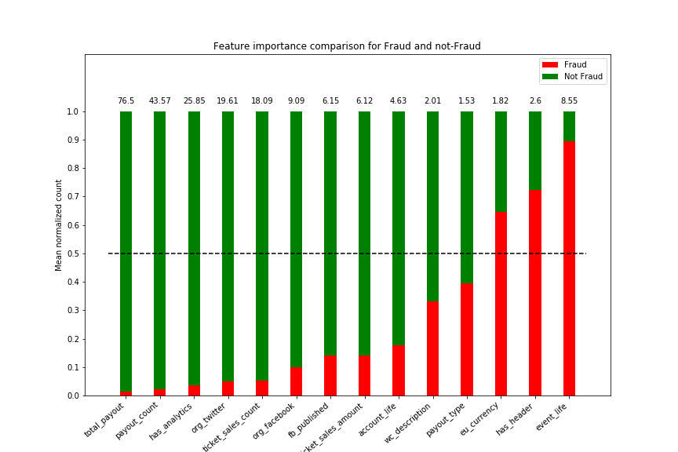
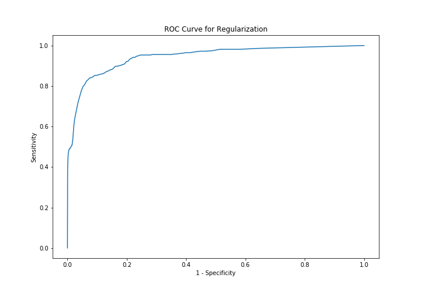

# Fraud Detection Case Study
# Galvanize Data Science Immersive

-- Tyler Carstensen, Wallace Printz, Sanhita Joshi
Fraud Detection Model for &lt;event-company>. Dataset is not shared on git due to confidentiality.

---


### Feature Selection


To train the model to predict fraud or not-fraud, 250MB of JSON data (14000+ rows) was provided by the company.  The dataset is structured with users labeled in several classes, but importantly, the known fraud events are labeled. The event training data has 43 features, many of which are not useful for predicting fraud.   

To determine the principle features to include in our model training set, we determined individual feature separation distance between fraud and non-fraud events. For example, if Feature 1 has a mean value of 2 for fraud events and a mean value of 20 for non-fraud events, we consider this separation 10X and is a good feature to use for model fitting. We used features for which separation is more than 1.5X.




__Relative ratios of features for fraud and not-fraud (examples)__

| Feature | Fraud | Not Fraud | Feature Separation | Description |
| --------| ----- | --------- | ----------- | --------- |
| total_payout | 0.01 | 0.98 |  76.5 | Total amount payed out after event |
| payout_count| 0.02|0.98| 43.57 |Number of times the account was paid to |
|has_analytics|0.03|0.96| 25.85 | Was analytics used in the event planning web page ? |
| org_twitter|0.04|0.95| 19.61 | Number of Twitter followers of event |
| fb_published| 0.13| 0.86| 6.15 | Was event published on FaceBook ? |
| ticket_sales_count|0.05|0.95| 18.09| How many tickets were sold |
|org_facebook |0.1|0.99| 9.09 | Number of users in Facebook Group |
| account_life| 0.18 | 0.82| 4.63 |Number of days from user creation to event date |
| wc_description | 0.33| 0.66  | 2.01 | Number of words in event description |
|payout_type (exists)|0.4|0.6| 1.53 | Method of payment after the event |
| eu_currency|0.64|0.35| 1.82 | If EU currencies (euro, GBP) were used for the transaction |
|has_header|0.72|0.2| 2.6 | If there is header in the event information|
|event_life|0.39|0.6| 8.55 | Number of days between event creation and event end |


|*Unused* (examples)| Fraud | Not Fraud | Feature Separation |
| --------| ----- | --------- | ----------- |
|listed |0.49|0.51| 1.04 |
|show_map |0.46 | 0.54| 1.17 |
|has_logo | 0.43| 0.57 | 1.32 |


---
Some example code used to find if the feature was important or not -

```python
fraud = df[df['acct_type'].str.contains('fraud')][col].mean()
not_fraud = df[~df['acct_type'].str.contains('fraud')][col].mean()
separation = fraud / not_fraud
```


The plot below is for one feature, we used in the model, account_life. On x-axis is the number of days for which the account is active; y-axis represents the ratio of fraud to genuine accounts' numbers, for the corresponding x-axis value. For genuine accounts, account_life is more than 4 times than the fraud accounts on an average.


---
# Data Pipeline

*Converting features into continuous or categorical numbers*

A class definition "pipeline_json" was implemented to transform and scale the data in order to convert the JSON data files into model-ready Pandas dataframes.

This class instance is used in both fitting the training data as well as predicting on out-of-sample or unseen data.  

Within the class, multiple methods are used to convert the data fields of interest into binary boolean values, continuous values, as well as return the labeled results array separately.

Example code for converting event description into a continuous variable:

```python
from BeautifulSoup import BeautifulSoup
lst = []
for i in xrange(len(df)):
    lst.append(len(BeautifulSoup(df['description'][i]).text))
```

*Scaling and normalizing the features*

The class instance provides an advantage over a simple method because a scaling transformation from the sklearn.StandardScaler can be stored in the class instance. The training dataset scaling parameters were saved; and are later used to scale the out-of-sample data. This ensures consistent scaling and hence better predicting power of the model.

---
# Model fitting

Multiple models were tested using a 75/25 train-test split.  Predictive power was determined by ROC curves and confusion matrices, when possible.

# Preliminary models
*Logistic Regression*

Logistic Regression from stat.models and sci-kit-learn was used to fit a model. This is a ROC curve from a model-fit.



Optimal Threshold was 0.3 for our purposes.  

We lost accuracy by selecting a good threshold - but the intent was to capture more true positives.

---

<!-- Observed high p-values for some features
 -->


*Other models*

Other models like GradientBoost and AdaBoostClassifier were tried, but did not give much improvement in confusion_matrix after GridSearch.

# Random Forests

We used the same train-test split fraction of 0.75/0.25 to fit random forest models on the data.

The best Model parameters found using GridSearch are -

```python
from sklearn.ensemble import RandomForestClassifier as RF
rf = RF(n_estimators=50, min_samples_split=20, min_samples_leaf=1,   min_impurity_split=1e-5, max_depth = 30, oob_score=True)
rf.score(X_test, y_test)
= 0.986
print 'Confusion matrix :\n', confusion_matrix(y_test, y_pred)
```

|Predicted |Observed  |
|--|--|
|TP: 288 | FP: 19 |
|FN: 30   | TN: 3242|


---

# Data management Pipelines

[Show data management flow]


---

# Presentation Dashboard

A Flask web app was implemented to draw fraudulent events from the PostgreSQL database.  The fraudulent events are scored and sorted by risk-adjusted-value, where :
* risk_score = probability_of_fraud * total_payout

This allows company fraud investigators to quickly focus on the events most likely to have the largest financial impact to the company.
